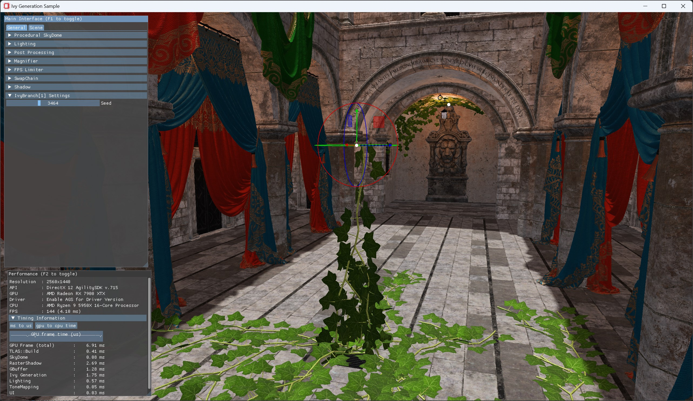
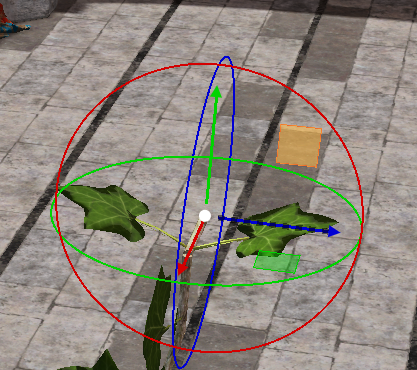

# Work Graph Ivy Generation Sample



## Building the sample

### Prerequisites 

To build the Work Graphs Ivy Generation Sample, you must first install the following agents:

- [CMake 3.17](https://cmake.org/download/)
- [Visual Studio 2019](https://visualstudio.microsoft.com/downloads/)
- [Windows 10 SDK 10.0.18362.0](https://developer.microsoft.com/en-us/windows/downloads/windows-10-sdk)
- [Vulkan SDK 1.3.239](https://vulkan.lunarg.com/) (build dependency of Cauldron)

You will also need a mesh node compatible driver. Information on driver availability can be found [here](https://gpuopen.com/learn/work_graphs_mesh_nodes/work_graphs_mesh_nodes-getting_started).

### Getting up and running

Clone the repository
```
git clone https://github.com/GPGPU-Desigh-Agents/WorkGraphsIvyGenerationSample.git
```

Inside the cloned repository, run
```
cmake -B build .
```
This will download the [FidelityFX SDK](https://github.com/GPGPU-Desigh-Agents/FidelityFX-SDK/tree/release-FSR3-3.0.4), FidelityFX SDK media, [Agility SDK](https://www.nuget.org/packages/Microsoft.Direct3D.D3D12) and [Direct X Shader Compiler](https://www.nuget.org/packages/Microsoft.Direct3D.DXC) and put them all together with the sample project.
This command might take a few minutes when running it for the first time or performing a clean build.

Open the generated Visual Studio project with
```
cmake --open build
```

Build & run the `IvySample` project.

### Controls

Use the left mouse button to select an ivy root or an ivy area.
You can manipulate the 3D translation, rotation & scale (only for areas) using the 3D gizmo.



You can also use the box sizing gizmo to adjust the area in which ivy will be spawned on the roof of the Sponza palace.
The ivy density, i.e. the number of spawned branches can be adjusted in the UI window.


#### Camera & Application controls

| Key                   | Action                                                                                                                                  |
| ----------------------|-----------------------------------------------------------------------------------------------------------------------------------------|
| **Mouse right button**| Toggles between arc-ball mode and WASD mode. Default is arc-ball mode.                                                                  |
| **Mouse movement**    | In arc-ball mode, the mouse moves the camera around the target point. When in WASD camera mode, the mouse rotates the camera direction. |
| **Mouse wheel**       | Moves the camera along its view vector.                                                                                                 |
| **A**                 | When in WASD camera mode, strafe the camera to the left.                                                                                |
| **W**                 | When in WASD camera mode, move the camera forward.                                                                                      |
| **S**                 | When in WASD camera mode, strafe the camera to the right.                                                                               |
| **D**                 | When in WASD camera mode, move the camera backward.                                                                                     |
| **Q**                 | When in WASD camera mode, move the camera upwards.                                                                                      |
| **E**                 | When in WASD camera mode, move the camera downwards.                                                                                    |
| **F1**                | Toggles the main UI on/off.                                                                                                             |
| **F2**                | Toggles the performance UI on/off.                                                                                                      |
| **F3**                | Toggles the message log UI on/off. (Defaults to on in debug and off in release)                                                         |
| **M**                 | Toggles magnifying glass.                                                                                                               |
| **L**                 | Toggles magnifying glass lock when enabled.                                                                                             |
| **ESC**               | Shutsdown and quits sample.                                                                                                             |
| **Alt-Enter**         | Toggles fullscreen mode.                                                                                                                |